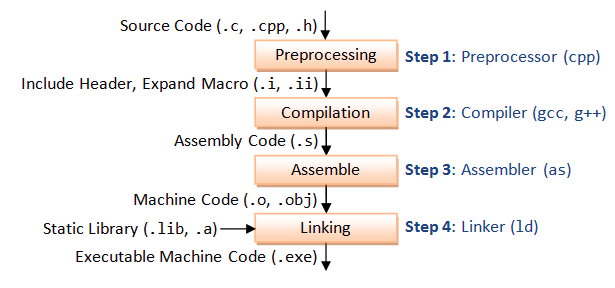

# What is Assembly Language?
We've all written code in High Level languages like C, C++, Java, Python, Bash, HTML, JavaScript, etc. But does the computer really understand what it means? 
 

No! Which is why we need a Compiler to basically translate the human understandable language to machine understandable language(machine code). This is what we get when we compile a program. Remember the `gcc <source-code.c> -o <output-file>` we do? This basically tells the compiler(which in our case is gcc) to take the human readable C code fom the `source-code.c` file and output an `output-file` which we can then execute typing `./output-file` in the terminal. The thing we need keep in mind here is all what the computers understand are `0`s and `1`s.
 

And between high level languages and machine code, there comes a stage which is assembly code. When we use a compiler, Our code goes through multiple stages. The **preprocessor**, **compiler**, **assembler** and the **linker**.

_Compilation Process of Source Code File._

## Why Learn Another Language?
- **Unlock the Full Potential of Hardware**: Assembly gives you full control over the processor and other peripheral devices allowing you to make the machine do things which require extra access, or for critical tasks that need fast execution.

- **Direct Hardware Manipulation**: Access and manipulate hardware resources like registers, memory addresses, and peripheral devices with more precision and efficienct than high level languages 

- **Deep Understanding of Computing**: Learning assembly gives you a great idea about how computers really work, and about the underlying mechanisms and computer architecture.

- **Master Low Level Concepts**: Solidify your understanding of fundamental computing concepts like memory management, etc.

- **Write Device Drivers and OS Kernels**: Contribute to the core of computer systems by crafting efficient code for interfacing with hardware and managing system resources.

- **Get Better at Reverse Engineering**: Having the understanding of assembly can help you when you're trying to reverse other binaries, softwares, malwares, etc. 

----

Exciting Right?! So, without wasting any more time, let's now get straight to the topic.

## Prerequisites

<!--Footer><Footer/!-->
Let's Connect:
[Linkedin](https://www.linkedin.com/in/nimishdudhe) | [Twitter](https://www.twitter.com/SecOvfShanks) | [TryHackMe](https://www.tryhackme.com/p/SecOvfShanks) | [GitHub](https://www.github.com/nimishdudhe01)